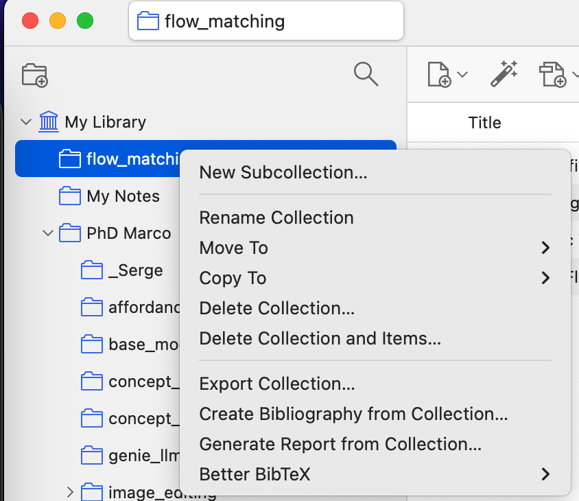
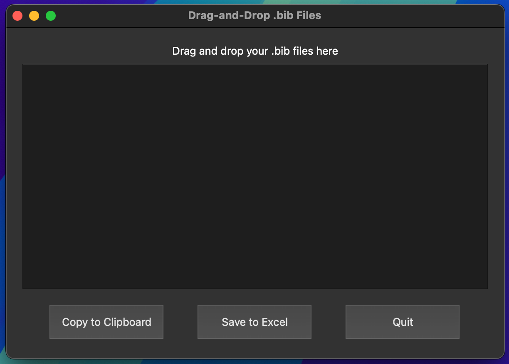
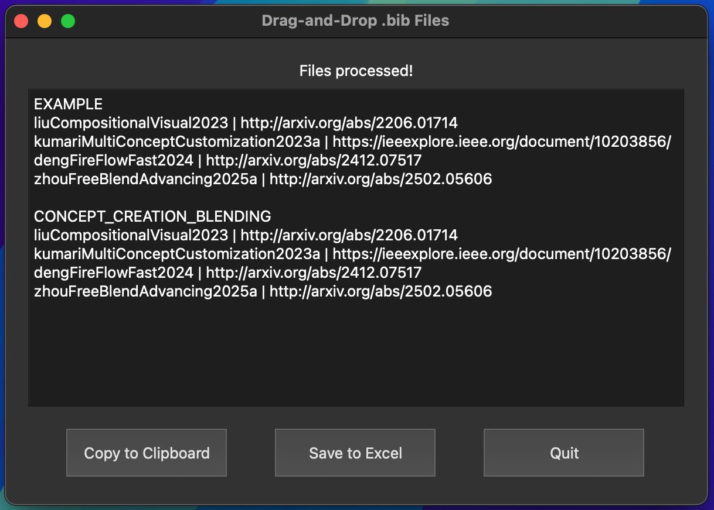
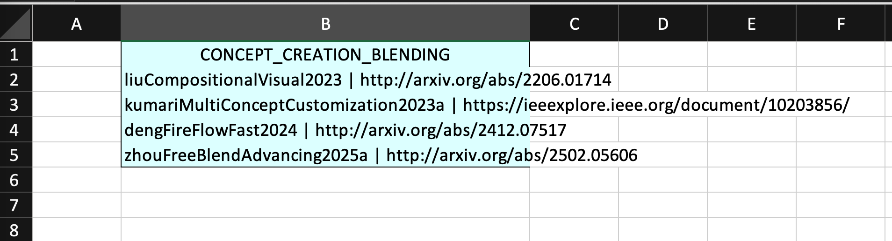

# Fix Bib Application

## Installation

1. Install dependencies by running the following command:
    ```bash
    pip install -r requirements.txt
    ```

2. Run the application with:
    ```bash
    python main.py
    ```

## Creating an Executable

To create a standalone executable, use the following command:
```bash
pyinstaller --onefile --windowed main.py
```
## Usage

1. Export your BibTeX files using BetterBibLaTeX.

    

2. Drag and drop your exported BibTeX files into the application window.

    

3. The application will process the files and generate an output Excel file in your Downloads folder.

    

4. Open the generated Excel file to view the processed data.

    

---

## credits
@marcoschouten